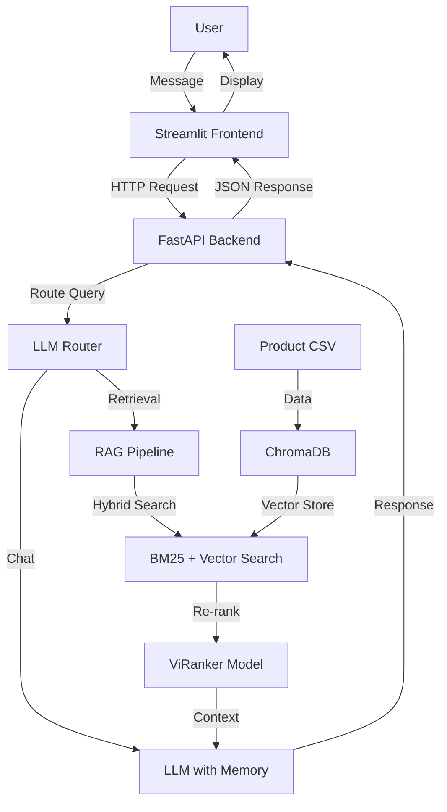
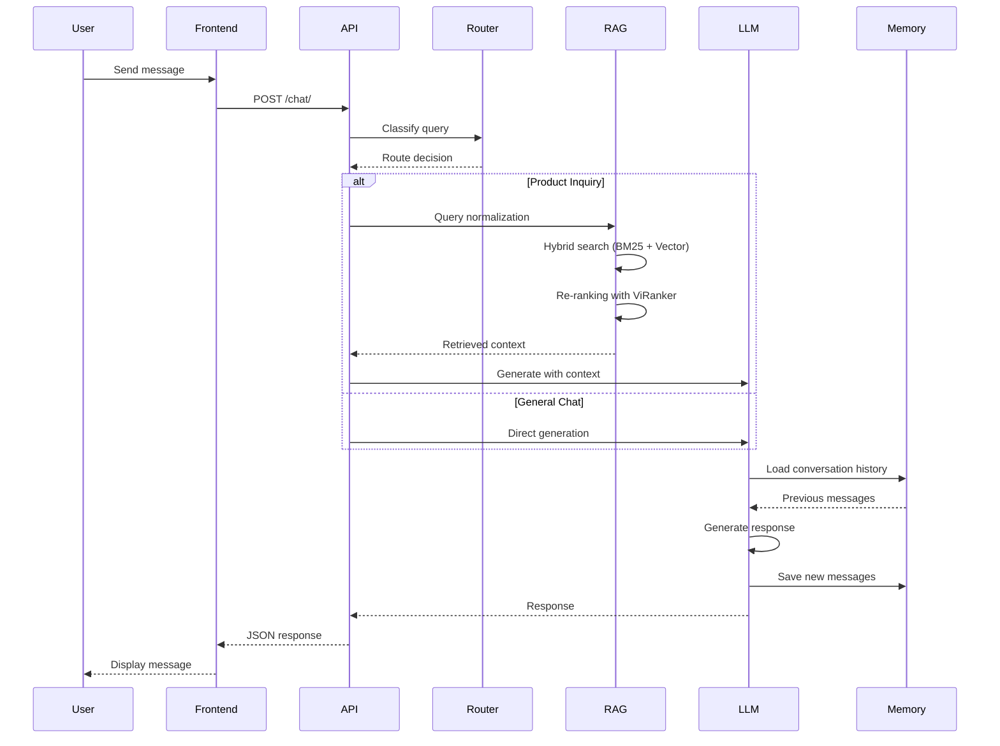
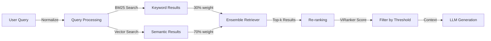

# RAG Mobile - Intelligent Phone Shop Chatbot

A Retrieval-Augmented Generation (RAG) chatbot system designed for phone shop customer service. The system combines vector search, hybrid retrieval, and large language models to provide intelligent product recommendations and customer support.

## Overview

This project implements a production-ready RAG system that can:
- Understand customer queries in Vietnamese
- Route queries intelligently (general chat vs product search)
- Retrieve relevant product information from a knowledge base
- Generate contextual responses using LLM with conversation memory
- Provide a user-friendly web interface

## System Architecture



## How It Works

### Request Flow Diagram



### RAG Pipeline



## Key Features

### 1. Intelligent Query Routing
- Automatically classifies user queries as chat or product search
- Uses LLM to understand user intent
- Normalizes queries for optimal search performance

### 2. Hybrid Search System
- Combines BM25 (keyword-based) and vector search (semantic)
- Weighted ensemble: 30% BM25, 70% vector similarity
- Reciprocal rank fusion for result combination

### 3. Advanced Re-ranking
- Cross-encoder re-ranking using ViRanker model
- Score-based filtering to ensure relevance
- Improves retrieval accuracy significantly

### 4. Conversation Memory
- Persistent conversation threads with unique IDs
- Automatic message summarization when threshold exceeded
- Maintains context across multiple interactions

### 5. Multi-Provider LLM Support
- Google Gemini integration (primary)
- Ollama local model support (alternative)
- Automatic retry logic for API failures

## Technology Stack

- **Backend**: FastAPI, Uvicorn
- **Frontend**: Streamlit
- **LLM Framework**: LangChain, LangGraph
- **Vector Database**: ChromaDB
- **Embedding**: Sentence Transformers (Vietnamese)
- **LLM**: Google Gemini 2.5 Flash
- **Re-ranking**: ViRanker (namdp-ptit/ViRanker)

## Installation

### Prerequisites
- Python 3.12+
- Google API Key (for Gemini)

### Quick Start

1. Install dependencies:
```bash
pip install -r requirements.txt
```

2. Set environment variables:
```bash
export GOOGLE_API_KEY="your-api-key-here"
```

3. Start API server:
```bash
uvicorn api:app --reload --port 8000
```

4. Start frontend:
```bash
streamlit run streamlit.py
```

5. Access:
   - Frontend: http://localhost:8501
   - API Docs: http://localhost:8000/docs

## Project Structure

```
rag-mobile/
├── api.py                 # FastAPI backend
├── streamlit.py           # Streamlit frontend
├── data/
│   └── core.py           # Data processing and ChromaDB setup
├── generation/
│   ├── llm_stm.py       # Chat with memory implementation
│   └── model.py         # LLM wrapper and providers
└── retrival/
    ├── llm_router.py    # Query routing logic
    └── re_rank.py       # Hybrid search and re-ranking
```

## API Endpoint

### POST `/chat/`
Process chat messages and return responses.

**Request:**
```json
{
  "message": "string",
  "thread_id": "string (optional)"
}
```

**Response:**
```json
{
  "thread_id": "string",
  "conversation_id": "string",
  "response": "string"
}
```
